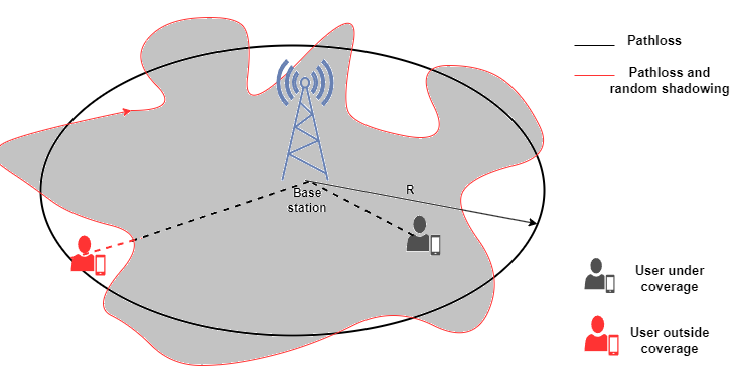

In previous experiment, we explored fundamental concepts like pathloss and shadowing, which significantly influence wireless system design. In wireless communication, maintaining a minimum level of received power is crucial—for instance, for ensuring cellular voice quality remains above a specific threshold, we need to recieve a certain amount of power. However, pathloss and shadowing introduce attenuation effects that impact received power. To effectively characterize this fading phenomenon, a comprehensive understanding of outage and coverage becomes essential.

## Outage Probability, $P_{out}$
Outage probability is a critical metric in wireless communication systems, representing the likelihood that the received signal power at a certain distance falls below a specified threshold, making the communication link unreliable. In practical terms, it quantifies the probability that a user will experience poor connectivity or dropped calls. Mathematically, it is a function of the target minimum received power, $P_{min}$ (threshold) and the received power at a distance, d, and can be written as

$$
\begin{aligned}
    P_{out}\left(d,P_{min}\right) = P\left(P_r(d) < P_{min}\right)
\end{aligned}
$$

Considering the log normal distance for shadowing, we have

$$
\begin{aligned}
    P_{out}\left(d,P_{min}\right) = 1 - Q\left(\frac{P_{min}-PL}{\sigma_{\psi_{dB}}}\right)
\end{aligned}
$$

where PL is the total pathloss that accounts for both linear pathloss and shadowing and $\sigma_{\psi_{dB}}$ is the standard deviation of the shadowing in dB. Q(.) is the Gaussian tail function, giving the probability that a normally distributed variable exceeds a certain value.

The above equation allows to predict how often users in different locations may experience poor connectivity. A high outage probability means that many users will experience dropped calls or low data rates.

## Cell Coverage Area
Closely related to outage probability is the concept of coverage area. Imagine a cellular base station emitting radio signals into the surrounding environment. The coverage area is the region within which the signal is strong enough to meet or exceed the required minimum power requirement $P_{min}$. Several factors including transmission power, antenna characteristics, environmental conditions, and the effects of pathloss and shadowing influence the extent of this coverage area. We can define it in the area $P_A$ in which the recieved power $P_r(d)$ is higher than $P_{min}$ and is given as 

$$
\begin{aligned}
    C = E\left[\frac{1}{\pi R^2} \int_{\text{cell area}} 1[P_r(d) > P_{min} \text{in dA}] dA\right]
\end{aligned}
$$

By studying outage probability and coverage together, we can design networks that balance coverage, capacity, and reliability, ensuring that users experience consistent connectivity even in challenging environments.

In this experiment, we will investigate outage probability to understand its implications on wireless system design. By examining the conditions under which outage occurs, we can identify strategies to enhance coverage and reliability. This analysis will provide valuable insights into optimizing wireless networks to minimize outage probability and ensure consistent performance.
