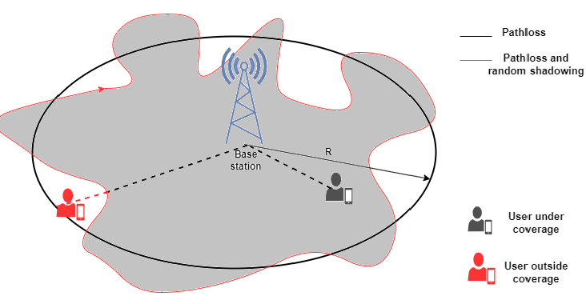

In previous experiment, we explored fundamental concepts like pathloss and shadowing, which significantly influence wireless system design. In wireless communication, maintaining a minimum level of received power is crucial—for instance, for ensuring cellular voice quality remains above a specific threshold, we need to recieve a certain amount of power. However, pathloss and shadowing introduce attenuation effects that impact received power. To effectively characterize this fading phenomenon, a comprehensive understanding of outage and coverage becomes essential.

More generally, wireless link reliability is determined not only by received power but by the **signal-to-interference-plus-noise ratio (SINR)**.  
Thus, outage probability is formally defined as the probability that the instantaneous SINR falls below a required threshold for reliable communication.

## Outage Probability, $P_{out}$

Outage probability is a critical metric in wireless communication systems, representing the likelihood that the received signal power at a certain distance falls below a specified threshold, making the communication link unreliable. In practical terms, it quantifies the probability that a user will experience poor connectivity or dropped calls.

Formally, outage can be expressed as a **probability event**:

$$
P_{out} = P(\text{SINR} < \beta),
$$

where $\beta$ is the minimum SINR required for acceptable quality of service.  

Mathematically, it is a function of the target minimum received power, $P_{min}$ (threshold) and the received power at a distance $d$, and can be written as

$$
\begin{aligned}
    P_{out}\left(d,P_{min}\right) = P\left(P_r(d) < P_{min}\right)
\end{aligned}
$$

Recall from experiment 1 that the recieved power at a distance $d$ is given as

$$
\begin{aligned}
    P_r(d) = P_t + 10\log_{10}K - 10\gamma \log_{10} \frac{d}{d_0} - \psi_{dB}
\end{aligned}
$$

Since the shadowing term $\psi_{dB}$ follows a **Gaussian distribution in dB**, the received power is also a **Gaussian random variable**.  
Therefore, outage probability can be computed directly using the **Gaussian cumulative distribution function**, which links received-signal statistics to link reliability.

Using this, we can now write the outage probability as

$$
\begin{aligned}
    P_{out}\left(d,P_{min}\right) = 1 - Q\left(\frac{P_{min}-P_r(d)}{\sigma_{\psi_{dB}}}\right)
\end{aligned}
$$

where $\sigma_{\psi_{dB}}$ is the standard deviation of the shadowing in dB (ranging from 4 to 13 dB) and $Q(\cdot)$ is the Gaussian tail function.

This expression provides important physical insight:

- **Higher transmit power $P_t$ → larger $P_r(d)$ → lower outage probability**
- **Larger shadowing variance $\sigma$ → greater signal uncertainty → higher outage**
- **Greater distance $d$ → stronger pathloss → increased outage**

Thus, outage probability directly captures how **propagation conditions and system design parameters influence link reliability**.

The above equation allows us to predict how often users in different locations may experience poor connectivity. A high outage probability means that many users will experience dropped calls or low data rates.

---

## Cell Coverage Area

Closely related to outage probability is the concept of coverage area. Imagine a cellular base station emitting radio signals into the surrounding environment. The coverage area is the region within which the signal is strong enough to meet or exceed the required minimum power requirement $P_{min}$. Several factors including transmission power, antenna characteristics, environmental conditions, and the effects of pathloss and shadowing influence the extent of this coverage area.

From a probabilistic viewpoint, **coverage is simply the complement of outage**.  
Hence, coverage describes the **fraction of spatial locations** where reliable communication is achievable.

We can define it as the area $P_A$ in which the recieved power $P_r(d)$ is higher than $P_{min}$ and is given as 

$$
\begin{aligned}
    C = E\left[\frac{1}{\pi R^2} \int_{\text{cell area}} 1[P_r(d) > P_{min} \text{ in dA}] \, dA\right]
\end{aligned}
$$

The cell coverage can be expressed as

$$
\begin{aligned}
    C = P\left(P_r(d) \geq P_{min}\right) = 1 -  P_{out}\left(d,P_{min}\right) = Q\left(\frac{P_{min}-P_r(d)}{\sigma_{\psi_{dB}}}\right)
\end{aligned}
$$

This relationship highlights key design intuition:

- Increasing **transmit power** expands the coverage radius.  
- Severe **shadowing environments** shrink reliable coverage.  
- Choosing an excessively high **minimum power threshold** reduces the usable cell area.

Therefore, outage probability and coverage together provide a **complete large-scale reliability characterization** of wireless cellular systems.

In this experiment, we will investigate outage probability to understand its implications on wireless system design. By examining the conditions under which outage occurs, we can identify strategies to enhance coverage and reliability. This analysis will provide valuable insights into optimizing wireless networks to minimize outage probability and ensure consistent performance.
